# SpotifyUnWrapped

SpotifyUnWrapped is a Python script that provides an accurate and on-demand recap of your Spotify listening history, including your top tracks and artists. By allowing you to access your true listening habits year-round, this project challenges the accuracy of Spotify Wrapped and shows that your music story is more dynamic than a single annual snapshot.

---

## Why SpotifyUnWrapped?

Spotify Wrapped is a fun and popular feature, but it doesn’t always reflect your true listening habits. Its algorithms can skew data due to:
- Limited time frames.
- Exclusion of certain types of streams.
- Emphasis on engagement rather than accuracy.

**SpotifyUnWrapped** aims to:
1. Give you full control over your music data with on-demand insights.
2. Provide a transparent and accurate reflection of your top tracks and artists.
3. Showcase that your listening history is more than what Spotify Wrapped portrays.

---

## Features

- Fetch your top tracks and artists over different time ranges (short, medium, or long term).
- Generate Markdown tables for sharing your personalized music stats.
- Create Mermaid diagrams to visualize your listening habits.
- Empower users with accurate data to challenge Spotify Wrapped's limitations.

---

## Prerequisites

1. Python 3.7 or higher installed on your machine.
2. A Spotify account with listening data.
3. A Spotify Developer account to create and manage your app.

---

## Setting Up the Spotify App

1. **Create a Spotify Developer Account**  
   Go to [Spotify for Developers](https://developer.spotify.com/dashboard/) and log in with your Spotify account.

2. **Create a New App**  
   - Navigate to the dashboard and click **"Create an App"**.
   - Provide a name (e.g., `SpotifyUnWrapped`) and description for your app.
   - Agree to the terms and click **"Create"**.

3. **Set the Redirect URI**  
   - In the app settings, scroll down to **Redirect URIs**.
   - Click **Add Redirect URI** and enter `http://localhost:8080/callback`.
   - Save the changes.

4. **Copy Your Client ID and Client Secret**  
   - In the app settings, locate the **Client ID** and **Client Secret**. You'll need these for the script.

---

## Installation

1. **Clone the Repository**  
   ```bash
   git clone https://github.com/your-username/SpotifyUnWrapped.git
   cd SpotifyUnWrapped
   ```

2. **Install Dependencies**  
   Install the required Python libraries using pip:
   ```bash
   pip install spotipy
   ```

3. **Set Up Your Credentials**  
   Open the `spotify_unwrapped.py` script and replace the placeholders with your Spotify Developer credentials:
   ```python
   CLIENT_ID = 'your_client_id'
   CLIENT_SECRET = 'your_client_secret'
   REDIRECT_URI = 'http://localhost:8080/callback'
   ```

---

## Usage

1. **Run the Script**  
   Execute the script in your terminal:
   ```bash
   python spotify_unwrapped.py
   ```

2. **Log In to Spotify**  
   - The script will open a browser window prompting you to log in to Spotify.
   - Once authenticated, you’ll be redirected to the callback URI, and the script will start fetching your data.

3. **View Your Stats**  
   - Top artists and tracks will be displayed in your terminal.
   - Markdown tables and Mermaid diagrams will be generated for easy sharing and visualization.

---

## Output Examples

### Markdown Table for Top Artists
```markdown
| Rank | Artist Name        |
|------|--------------------|
|  1   | Artist 1           |
|  2   | Artist 2           |
|  3   | Artist 3           |
```

### Mermaid Diagram

```mermaid
graph TD
    A[Top Artists and Tracks] --> B[Artists]
    A --> C[Tracks]
    B --> B0[Artist 1]
    B --> B1[Artist 2]
    B --> B2[Artist 3]
    B --> B3[Artist 4]
    B --> B4[Artist 5]
    B --> B5[Artist 6]
    B --> B6[Artist 7]
    B --> B7[Artist 8]
    B --> B8[Artist 9]
    B --> B9[Artist 10]
    C --> C0["Track 1 by Artist 1, Artist 2"]
    C --> C1["Track 2 by Artist 3"]
    C --> C2["Track 3 by Artist 4"]
    C --> C3["Track 4 by Artist 5, Artist 6"]
    C --> C4["Track 5 by Artist 7"]
    C --> C5["Track 6 by Artist 8"]
    C --> C6["Track 7 by Artist 9"]
    C --> C7["Track 8 by Artist 10"]
    C --> C8["Track 9 by Artist 1"]
    C --> C9["Track 10 by Artist 2"]
```


---

Rediscover your true music journey and prove that **Spotify Wrapped** doesn’t have the final word! 🎵
